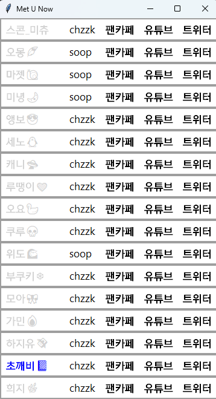
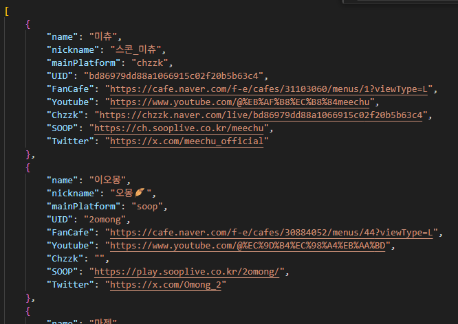

## streamer.json에 작성된 스트리머의 방송ON/OFF를 체크하는 윈도우앱
미리 작성된 유저에 대해 방송 on/off 여부와, 링크바로가기(클릭)을 제공합니다. 
 
 
## config.json의 auto-download 기능을 True로 설정하면
해당 방송인이 방송을 켰을때 자동으로 녹화가 시작됩니다. (FALSE를 권장합니다)  
VOD 다운로드는 기본적으로 통용되는 수준에서 체크했습니다 (5분할 고속다운로드 + m3u8기준 최고화질) 
이부분을 수정하면 더욱 고속 다운로드 가능하지만 본인책임입니다.
### tool폴더의 downloader.py만 따로 실행하면 chzzk기준으로 설계된 분할고속다운로드 기능을 사용가능합니다.
코덱에 대한 이해가 있다면 화질,비트레이트 위주로 다운받으시면 됩니다.2차창작이 목적이시라면 mp4로 변환하는걸 추천드립니다.

## License

This project is licensed under the MIT License - see the [LICENSE](LICENSE) file for details.

"본 소프트웨어 사용에 따른 모든 책임은 사용자에게 있습니다."
비공식 API사용시 과한 요청과 위법한 용도로 사용하지 마십시오.
"개발자는 어떠한 손해에 대해서도 책임지지 않습니다." 
"상업적 용도 사용 시 별도 법률 자문을 권고합니다."

THE SOFTWARE IS PROVIDED "SJDOK9612", WITHOUT WARRANTY OF ANY KIND, EXPRESS OR IMPLIED,
INCLUDING BUT NOT LIMITED TO THE WARRANTIES OF MERCHANTABILITY, FITNESS FOR A PARTICULAR
PURPOSE AND NONINFRINGEMENT. IN NO EVENT SHALL THE AUTHORS OR COPYRIGHT HOLDERS BE LIABLE
FOR ANY CLAIM, DAMAGES OR OTHER LIABILITY, WHETHER IN AN ACTION OF CONTRACT, TORT OR OTHERWISE,
ARISING FROM, OUT OF OR IN CONNECTION WITH THE SOFTWARE OR THE USE OR OTHER DEALINGS IN THE SOFTWARE.